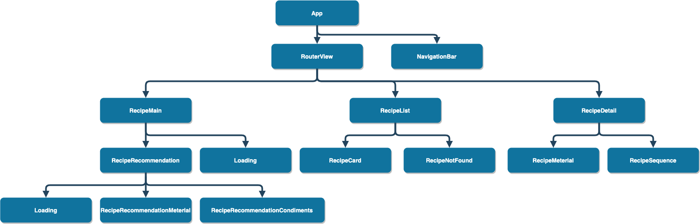
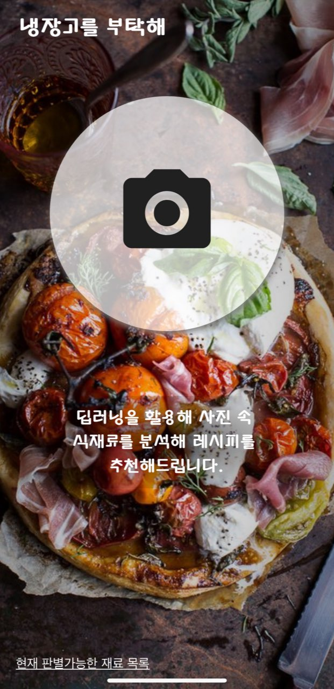
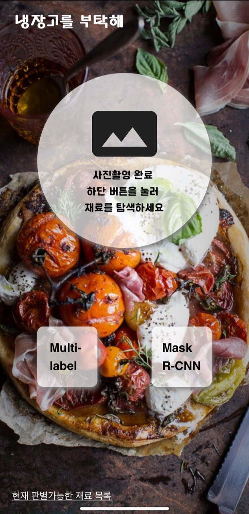
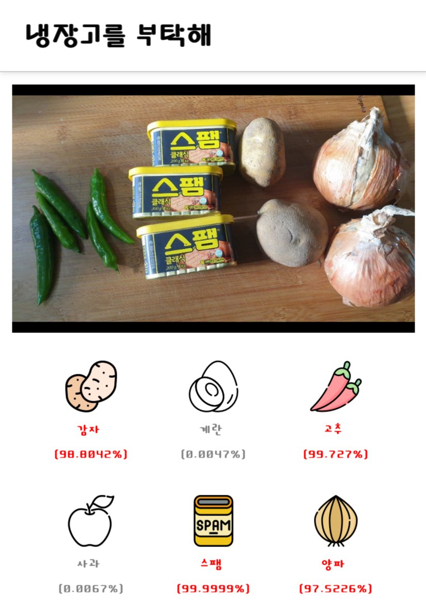
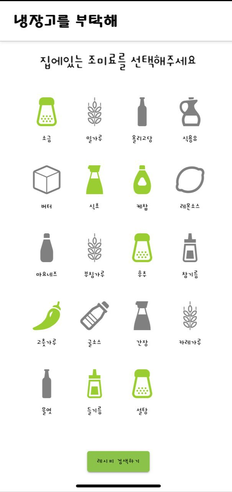
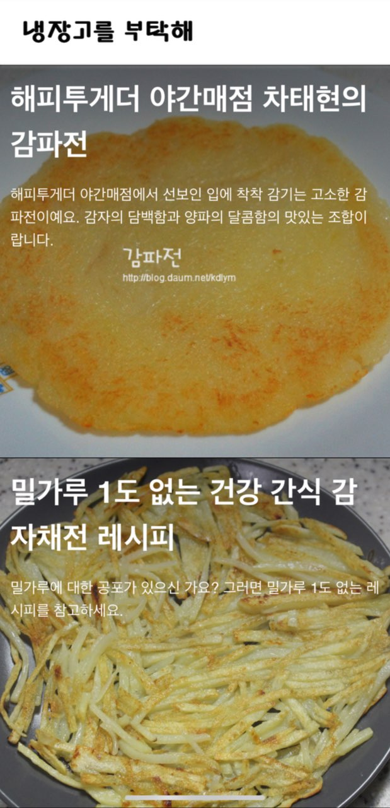
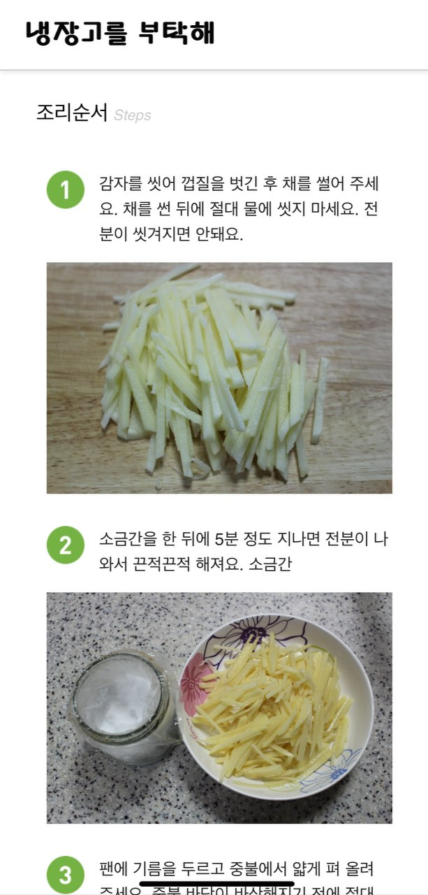
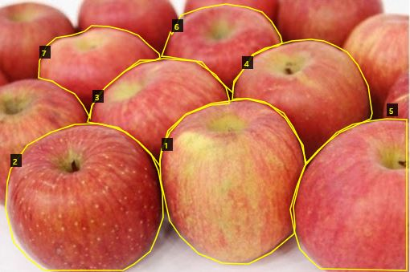
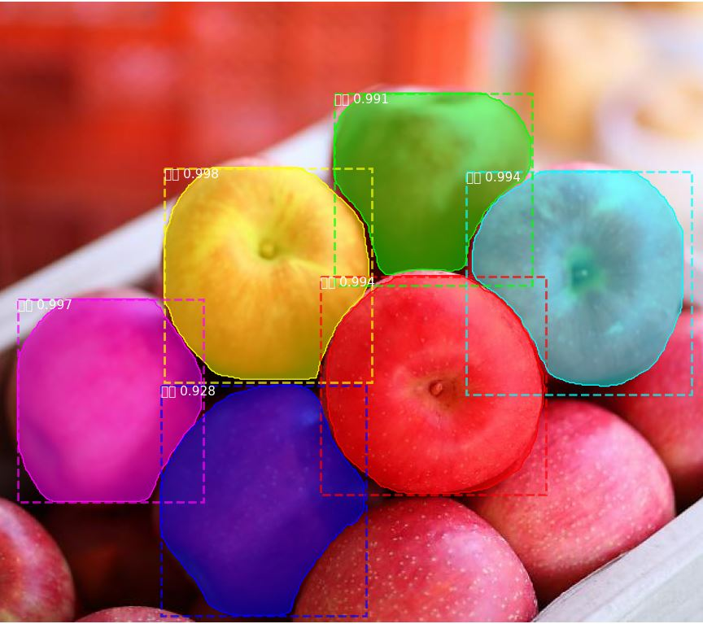

## Frontend

### 구조도



### 통신

```javascript
//http-common.js
import axios from "axios";

export default axios.create({
  baseURL: "http://i02b102.p.ssafy.io/",
  headers: {
    "Content-type": "application/json"
  }
});
```

```javascript
import http from "../services/http-common.js";
```

axios라이브러리를 사용하여 통신을 진행했으며,<br>
http-common.js파일로 모듈화하여 사용했습니다.<br>


### 1. 냉장고 사진 찍기




### 2. AI 모듈 선택하기




### 3. 판별된 재료 확인




### 4. 양념 선택




### 5. 해당하는 레시피 확인




### 6. 조리 순서 확인




## DataBase

### MySQL

```xml
참고 자료 : 공공 데이터 포털 사이트, 만개의 레시피
만개의 레시피 사이트의 경우 Selenium을 통한 스크래핑
```


- recipe_basic_info

| basic_coce | basic_name    | basic_intro         | basic_typecode | basic_type | basic_classcode | basic_class | basic_time | basic_kcal | basic_volume | basic_diff | basic_materialclass | basic_price | basic_imgurl  | basic_detailurl |
| :--------- | :------------ | :------------------ | :------------- | :--------- | :-------------- | :---------- | :--------- | :--------- | :----------- | :--------- | :------------------ | :---------- | :------------ | :-------------- |
| ex)1       | ex)나물비빔밥 | ex)육수로지은 . . . | ex)3020001     | ex)한식    | ex)3010001      | ex)밥       | ex)60분    | ex)580kcal | ex)4인분     | ex)보통    | ex)곡류             | ex)5000원   | ex)http://... | ex)http://...   |

---

- recipe_material_info

| material_code | material_number | material_name | material_volume | material_typecode | material_type |
| :------------ | :-------------- | :------------ | :-------------- | :---------------- | :------------ |
| ex)1          | ex)1            | ex)쌀         | ex)4컵          | ex)3060001        | ex)주재료     |

---

- recipe_process_info

| process_code | process_order | process_info      | process_imgurl | process_tip          |
| :----------- | :------------ | :---------------- | :------------- | :------------------- |
| ex)1         | ex)1          | ex)양지머리 . . . | ex)http://...  | ex)차가운 물 부터... |

---

### Selenium


- 만개의 레시피 사이트 자료를 통해 자동으로 쿼리문을 작성해주는 프로그램 작성

```java
public static final String WEB_DRIVER_ID = "webdriver.chrome.driver";
public static final String WEB_DRIVER_PATH = "lib/selenium/chromedriver.exe";

public void query_set(){
    File file1 = new File("C:\\Users\\Hoony\\Desktop\\basic.txt");
	BufferedWriter bufferedWriter1 = new BufferedWriter(new FileWriter(file1));

	File file2 = new File("C:\\Users\\Hoony\\Desktop\\material.txt");
	BufferedWriter bufferedWriter2 = new BufferedWriter(new FileWriter(file2));

	File file3 = new File("C:\\Users\\Hoony\\Desktop\\process.txt");
	BufferedWriter bufferedWriter3 = new BufferedWriter(new FileWriter(file3));

	recipe_crawling(bufferedWriter1, bufferedWriter2, bufferedWriter3);
		
	bufferedWriter1.close();
	bufferedWriter2.close();
	bufferedWriter3.close();
}

public void recipe_crawling(BufferedWriter bufferedWriter1, BufferedWriter bufferedWriter2, BufferedWriter bufferedWriter3){

    ChromeOptions option = new ChromeOptions();
	option.setHeadless(true);
    WebDriver driver = new ChromeDriver(option);
    //selenium setting

    int page = 1;

    while(true){
        String url = "https://www.10000recipe.com/recipe/list.html?cat4=65&order=reco&page=" + page;
    
        driver.get(url);

        WebElement webElement = driver.findElement(By.className("rcp_m_list2");

        int index = 0;

        while(true){
            if(index == 44){
                break;
                //페이지별 Element 수가 44개가 될 경우 중지
                //그 이상은 존재하지 않음
            }
            ...
            생략
            ...

            bufferedWriter1.write("insert into recipe_basic_info...생략");
			bufferedWriter1.newLine();
				
			for(int i=0; i<list.size(); i++) {
				bufferedWriter2.write("insert into recipe_material_info...생략");
				bufferedWriter2.newLine();
			}
				
			for(int i=0; i<process.size(); i++) {
				bufferedWriter3.write("insert into recipe_process_info...생략");
				bufferedWriter3.newLine();
			}
        }
    }
}
```

- JDBC를 활용하여 직접적으로 데이터를 Insert하면 시간적으로 손실을 줄일 수 있음.

---


## AWS

### NginX

- Web Server를 위한 프레임 워크이다.
- http 통신을 위해 80포트로 열고, /recipes/ 주소로 시작하는 요청이 있을 경우 WSGI Server로 Reverse Proxy 해준다.

```
server {

    listen      80;

    server_name i02b102.p.ssafy.io;
    #domain

    charset utf-8;

    root    /home/ubuntu/amt2/frontend/dist;
    # front-end

    index   index.html index.htm;
    client_max_body_size 100M;
    location / {
        try_files $uri $uri/ @rewrites;
    }

    location @rewrites {
        rewrite ^(.+)$ /index.html last;
    }

    location ~* \.(?:ico|css|js|gif|jpe?g|png)$ {
        expires max;
        add_header Pragma public;
        add_header Cache-Control "public, must-revalidate, proxy-revalidate";
    }

    location /static/ {
        alias /home/ubuntu/amt2/backend/static;
    }

    location /recipes/ {
        proxy_pass      http://127.0.0.1:8085/recipes/;
        # 주소 뒤에 /recipes/ 명령어로 호출시 내부 Gunicorn으로 동작중인
        # Django 쪽으로 요청을 보냄
    }
}
```


### Gunicorn

- Web Server인 Nginx와 Django 프로젝트가 통신하기 위한 WSGI Server 프레임 워크이다.
- Nginx에서 들어오는 특정 요청에 대해 Django 프로젝트와 MySQL에서 로직을 처리하여 다신 전달해준다.
- WSGI Server를 로컬로 열어 외부에서의 직접 접근을 차단하였다.

```
[Unit]
Description=gunicorn daemon
After=network.target

[Service]
User=ubuntu
Group=www-data
WorkingDirectory=/home/ubuntu/amt2/backend
ExecStart=/home/ubuntu/amt2/backend/venv/bin/gunicorn \
        --workers 3 \
        --bind 127.0.0.1:8085 \
        amtai.wsgi:application

[Install]
WantedBy=multi-user.target
```


## Backend

### Swagger


- basicinfo : 모든 요리 호출
- basicinfo/{dish_pk} : 해당 요리 기본 정보
- materialinfo/{basic_pk} : 해당 요리 재료 정보
- processinfo/{basic_pk} : 해당 요리 레시피 정보
- image_upload : 프론트에서 사진을 받아 multi-label 모델로 재료 식별
- mask_rcnn : 프론트에서 사진을 받아 mask-rcnn 모델로 재료 식별
- get_dishes : 재료와 조미료를 받은 후 알고리즘을 통해 일치하는 요리 제공

### 모델링

- DB Table에 맞춰 크게 3가지로 모델링 하였다.
  1. 요리 상세 정보
  2. 특정 요리의 재료
  3. 특정 요리의 레시피

```python
class RecipeBasicInfo(models.Model):
    basic_code = models.IntegerField(primary_key=True)
    basic_name = models.CharField(max_length=2000, blank=True, null=True)
    basic_intro = models.CharField(max_length=5000, blank=True, null=True)
		...;
    class Meta:
        managed = False
        db_table = 'recipe_basic_info'

class RecipeMaterialInfo(models.Model):
    recipe_material_id = models.AutoField(primary_key=True)
    material_code = models.ForeignKey(RecipeBasicInfo, models.DO_NOTHING, db_column='material_code')
    ...;
    class Meta:
        managed = False
        db_table = 'recipe_material_info'

class RecipeProcessInfo(models.Model):
    recipe_process_id = models.AutoField(primary_key=True)
    process_code = models.ForeignKey(RecipeBasicInfo, models.DO_NOTHING, db_column='process_code')
		...;
    class Meta:
        managed = False
        db_table = 'recipe_process_info'

```

### 이미지 형식 변환

- Vue에서 넘어온 Bytes 형식의 이미지를 인공지능 모델에서 식별할 수 있게 이미지의 형식을 Numpy array 형태로 변환해준다.

```python
img = request.FILES.get('file').read()
img = cv2.imdecode(np.frombuffer(img, np.uint8), -1)
image = cv2.resize(img, (299, 299))
image = image.astype("float") / 255.0
image = img_to_array(image)
image = np.expand_dims(image, axis=0)
```

### 요리 추천 알고리즘

- DB안에 있는 모든 음식의 재료와 사진에서 식별된 재료 및 조미료를 비교하여 일치하는 재료의 개수를 센 후, 일치하는 재료의 개수와 해당 레시피의 총 재료 개수가 같을 경우 해당 음식을 담는다.

```python
for dish in all_dishes:
    recipe_materials = RecipeMaterialInfo.objects.filter(material_code=dish.basic_code)
    cnt = 0
    for r_m in recipe_materials:
      for a_m in all_materials:
        if a_m == r_m.material_name:
          cnt += 1

    if len(recipe_materials) == cnt:
      dish_list.append(dish.basic_code)
```


## MASK RCNN

matterport / Mask_RCNN git source 사용


[train 모델 파일 - food.py 작성]

- load trained weights file

coco 데이터 전처리 가중치를 train model의 base로 사용

```python
# Path to trained weights file

COCO_WEIGHTS_PATH = os.path.join(ROOT_DIR, "mask_rcnn_coco.h5")


```


- train model configuration

  train model 설정

  백그라운드 포함 감자, 양파, 스팸, 계란, 고추, 사과 로 총 1+6개의 class 지정

  train epoch를 100으로 설정

```
class FoodConfig(Config):

  """Configuration for training on the toy dataset.

  Derives from the base Config class and overrides some values.

  """

  \# Give the configuration a recognizable name

  NAME = "food"


  \# We use a GPU with 12GB memory, which can fit two images.

  \# Adjust down if you use a smaller GPU.

  IMAGES_PER_GPU = 1


  \# Number of classes (including background)

  NUM_CLASSES = 1 + 6 # Background + balloon


  \# Number of training steps per epoch

  STEPS_PER_EPOCH = 100


  \# Skip detections with < 90% confidence

  DETECTION_MIN_CONFIDENCE = 0.9
```


- dataset configuration

  train시킬 dataset 변수 설정

  dataset class - 감자, 양파, 스팸, 계란, 고추, 사과

  annotation file load - via_region_data.json

  

```python
class FoodDataset(utils.Dataset):

	def load_food(self, dataset_dir, subset):
        self.add_class("food", 1, "감자")
        self.add_class("food", 2, "양파")
        self.add_class("food", 3, "스팸")
        self.add_class("food", 4, "계란")
        self.add_class("food", 5, "고추")
        self.add_class("food", 6, "사과")

	assert subset in ["train", "val"]
	dataset_dir = os.path.join(dataset_dir, subset)


	annotations = json.load(open(os.path.join(dataset_dir,"via_region_data.json"),encoding='UTF-8'))

	annotations = list(annotations.values())
	annotations = [a for a in annotations if a['regions']]

	for a in annotations:
		if type(a['regions']) is dict:
			polygons = [r['shape_attributes'] for r in a['regions'].values()]
		else:
			polygons = [r['shape_attributes'] for r in a['regions']] 

        foods = [s['region_attributes'] for s in a['regions']]

		num_ids = [int(n['key']) for n in foods]
		image_path = os.path.join(dataset_dir, a['filename'])
		image = skimage.io.imread(image_path, plugin='matplotlib')
		height, width = image.shape[:2]


	self.add_image(
		"food",
		image_id=a['filename'], # use file name as a unique image id
		path=image_path,
		width=width, height=height,
		polygons=polygons,
		num_ids=num_ids)

	def load_mask(self, image_id):
		info = self.image_info[image_id]
		if info["source"] != "food":
			return super(self.__class__, self).load_mask(image_id)
        
		num_ids = info['num_ids']
		mask = np.zeros([info["height"], info["width"], len(info["polygons"])],
		dtype=np.uint8)
        
		for i, p in enumerate(info["polygons"]):
			rr, cc = skimage.draw.polygon(p['all_points_y'], p['all_points_x'])
			mask[rr, cc, i] = 1

		num_ids = np.array(num_ids, dtype=np.int32)
		return mask, num_ids
```


- make annotation json file - via_region_data_json

  


- set train model batch size

  배치사이즈 설정 - epochs=60

```python
	def train(model):

		dataset_train = FoodDataset()
		dataset_train.load_food(args.dataset, "train")
		dataset_train.prepare()

		dataset_val = FoodDataset()
		dataset_val.load_food(args.dataset, "val")
		dataset_val.prepare()

		print("Training network heads")

		model.train(dataset_train, dataset_val,
		learning_rate=config.LEARNING_RATE,
		epochs=60,
		layers='heads')
```


- train food mask-rcnn model

```
python food.py train --dataset=C:\Mask_RCNN-master\datasets\food --weights=coco
```


[trained 모델 검증 - Inspect_Food_model.py 작성]

- load mask-rcnn model

  MaskRCNN 모델 import

```python
import model as modellib
ROOT_DIR = os.path.abspath("./")
MODEL_DIR = os.path.join(ROOT_DIR, "logs")
with tf.device(DEVICE):
    model = modellib.MaskRCNN(mode="inference", model_dir=MODEL_DIR,
    config=config)
```


- load trained weights file

  모델에 훈련된 가중치 파일을 적용

```python
weights_path = "C:\\Mask_RCNN-master\\samples\\food\\logs\\food20200428T1903\\mask_rcnn_food_0060.h5"
```

```python
model.load_weights(weights_path, by_name=True)
```


- run object model / visualize detected image and probability

```python
results = model.detect([image], verbose=1)

ax = get_ax(1)

r = results[0]
s = r['scores'].tolist()
j = 0
for i in r['class_ids'].tolist() :
	print(class_names[i], s[j])
	j+=1

visualize.display_instances(image, r['rois'], r['masks'], 	r['class_ids'],class_names, r['scores'])
```




## Multi-label


먼저 관련 케라스 모듈을 가져온 다음, `소형VGGNet` 클래스를 정의합니다.

```
class SmallerVGGNet:
	@staticmethod
	def build(width, height, depth, classes, finalAct="softmax"):
		# 인풋 이미지의 차원과, 채널에 해당하는 축을 설정하여 모델을 초기화합니다
		# "channels_last"는 채널의 축이 마지막에 오는 것을 의미합니다
		model = Sequential()
		inputShape = (height, width, depth)
		chanDim = -1
 
 		# 만약 "channels_first"를 사용한다면, 인풋 이미지의 차원을
		# 그에 맞게 바꿔줍니다
		if K.image_data_format() == "channels_first":
			inputShape = (depth, height, width)
			chanDim = 1
```

모델의 정의부입니다. `build` 함수를 통해 CNN모델을 만들 수 있습니다.

`build` 함수는 `width`, `height`, `depth`, `classes`의 총 네 가지 입력변수를 필요로 합니다. `depth`는 입력 이미지의 채널 수를 지정하며 `classes`는 범주/클래스의 개수(정수)입니다(클래스 라벨 자체는 아님). `train.py` 스크립트에서 이러한 매개변수를 사용하여 `299 x 299 x 3` 입력 볼륨을 갖는 모델을 만들 것입니다.

또한 `finalAct`(기본값 `"softmax"`)라는 옵션을 추가적으로 줄 수 있으며, 이는 네트워크 아키텍처의 끝에서 사용됩니다. 이 값을 `"softmax"`에서 `"sigmoid"`로 변경하여 다중 라벨 분류를 수행할 수 있습니다. 해당 옵션을 통해 단순/다중 라벨 분류를 위한 모델들을 모두 만들 수 있습니다.

모델은 디폴트 값인 `"channels_last"`를 기반으로 하고있으며, 코드 하단의 `if`문을 활용하면 `"channels_first"`으로 간편하게 설정 변경할 수 있습니다.

다음은 첫 `CONV => RELU => POOL`블록을 만들어볼 차례입니다.

```
		# CONV => RELU => POOL
		model.add(Conv2D(32, (3, 3), padding="same",
			input_shape=inputShape))
		model.add(Activation("relu"))
		model.add(BatchNormalization(axis=chanDim))
		model.add(MaxPooling2D(pool_size=(3, 3)))
		model.add(Dropout(0.25))
```

위의 합성곱 계층은 32개의 필터와 3 x 3 크기의 커널을 가지며, 최종 값은 ReLU 활성화 함수를 거치게 됩니다.

드롭아웃(Dropout)은 현재 계층과 다음 계층을 연결하는 노드들의 값을 무작위로 0으로 바꾸어주는 과정입니다(연결을 끊어주는 효과). 이러한 프로세스는 네트워크가 특정 클래스, 객체, 가장자리 또는 모서리를 예측하는데 있어 계층 내 어떠한 단일 노드에만 의존하지 않게 하여 네트워크의 과적합을 예방하는데 도움이 됩니다.

그 후 모델은 두개의 `(CONV => RELU) * 2 => POOL`블록을 거치게 됩니다.

```
		# (CONV => RELU) * 2 => POOL
		model.add(Conv2D(64, (3, 3), padding="same"))
		model.add(Activation("relu"))
		model.add(BatchNormalization(axis=chanDim))
		model.add(Conv2D(64, (3, 3), padding="same"))
		model.add(Activation("relu"))
		model.add(BatchNormalization(axis=chanDim))
		model.add(MaxPooling2D(pool_size=(2, 2)))
		model.add(Dropout(0.25))
 
		# (CONV => RELU) * 2 => POOL
		model.add(Conv2D(128, (3, 3), padding="same"))
		model.add(Activation("relu"))
		model.add(BatchNormalization(axis=chanDim))
		model.add(Conv2D(128, (3, 3), padding="same"))
		model.add(Activation("relu"))
		model.add(BatchNormalization(axis=chanDim))
		model.add(MaxPooling2D(pool_size=(2, 2)))
		model.add(Dropout(0.25))
```

여기서 주목해야 할 점은 필터의 개수와 커널의 크기, 그리고 풀링의 크기에 변화를 주어 공간의 크기는 점차 줄이지만, 깊이를 높인다는 것입니다.

다음은 마지막 블록인 `FC => RELU`입니다.

```
		# FC => RELU
		model.add(Flatten())
		model.add(Dense(1024))
		model.add(Activation("relu"))
		model.add(BatchNormalization())
		model.add(Dropout(0.5))
 
 		# 단일 라벨 분류는 *softmax* 활성화 함수를 사용합니다
		# 다중 라벨 분류는 *sigmoid* 활성화 함수를 사용합니다
		model.add(Dense(classes))
		model.add(Activation(finalAct))
 
 		# 네트워크 아키텍처를 반환합니다
		return model
```

완전하게 연결된 계층(Fully Connected layer)인 `Dense`는 모델의 마지막에 배치됩니다.

`Dense`의 결과 값은 마지막 활성화 함수인 `finalAct`를 거치게 됩니다. `"softmax"`를 사용하면 단일 라벨 분류를 수행하는 모델을 만들 수 있습니다. 본 튜토리얼에서는 다중 라벨 분류를 위해 `"sigmoid"`를 사용합니다(`smallervggnet.py`와 `train.py` 참조).

### 다중 라벨 분류를 위한 케라스 모델 구현

이제 `소형VGGNet`을 구현했으니, `train.py`를 작성할 차례입니다. 이 스크립트는 다중 라벨 분류를 위해 케라스 모델을 학습시키는데 사용됩니다.


이제 `train.py`파일을 만들어 아래와 같이 코드를 작성합니다.

```
# matplotlib의 백엔드를 설정하여 그림이 백그라운드에서 저장될 수 있게합니다
import matplotlib
matplotlib.use("Agg")
 
# 필요한 패키지들을 가져옵니다
from keras.preprocessing.image import ImageDataGenerator
from keras.optimizers import Adam
from keras.preprocessing.image import img_to_array
from sklearn.preprocessing import MultiLabelBinarizer
from sklearn.model_selection import train_test_split
from pyimagesearch.smallervggnet import SmallerVGGNet
import matplotlib.pyplot as plt
from imutils import paths
import numpy as np
import argparse
import random
import pickle
import cv2
import os
```


```
# construct the argument parse and parse the arguments
ap = argparse.ArgumentParser()
ap.add_argument("-d", "--dataset", required=True,
	help="path to input dataset (i.e., directory of images)")
ap.add_argument("-m", "--model", required=True,
	help="path to output model")
ap.add_argument("-l", "--labelbin", required=True,
	help="path to output label binarizer")
ap.add_argument("-p", "--plot", type=str, default="plot.png",
	help="path to output accuracy/loss plot")
args = vars(ap.par
se_args())
```

위 스크립트에는 총 네 가지의 인수들이 있습니다.

1. `--dataset` : 데이터 세트의 경로입니다.
2. `--model` : 디스크에 저장된 케라스 모델의 경로입니다.
3. `--labelbin` : 학습의 결과인 `MultiLabelBinarizer`가 저장될 경로입니다.
4. `--plot` : 학습 손실 값과 정확도 값의 그래프가 저장될 경로입니다.


다음은 학습 과정에서 중요한 역할을 수행하는 몇 가지 중요한 변수를 초기화하겠습니다.

```
# 학습을 위해 에폭과 초기 학습률, 배치 사이즈, 그리고 이미지의 차원을 초기화합니다
EPOCHS = 75
INIT_LR = 1e-3
BS = 32
IMAGE_DIMS = (299, 299, 3)
```

위의 변수들은 다음과 같은 의미를 갖습니다.

- 네트워크는 75 `EPOCHS`동안 역전파를 통해 점진적으로 패턴을 학습합니다.
- 초기 학습률(Learning rate)은 `1e-3`(Adam 옵티마이저의 기본값)입니다.
- 배치 크기는 `32`입니다. GPU를 사용하는 경우 GPU 성능에 따라 이 값을 조정해야 하지만, 이번 프로젝트에는 `32`의 배치 크기로 좋은 결과를 얻을 수 있습니다.
- 위에서 설명한 바와 같이 이미지의 크기는 `299 x 299`이며 3개의 채널을 가지고 있습니다.
- 

이 다음 두 개의 코드 블록은 학습 데이터 로드와 전처리를 수행합니다.

```
# 이미지 경로를 섞어줍니다
print("[INFO] loading images...")
imagePaths = sorted(list(paths.list_images(args["dataset"])))
random.seed(42)
random.shuffle(imagePaths)
 
# 데이터와 라벨을 초기화합니다
data = []
labels = []
```

여기서는 `imagePaths`(영상 경로)를 읽어와 무작위로 섞어준 다음, 데이터와 라벨 목록을 초기화합니다.

그런 다음 `imagePaths`의 각각의 경로에 대해 이미지 데이터를 전처리하며 다중 클래스 라벨을 추출합니다.

```
# 인풋 이미지들에 대해 아래의 반복문을 수행합니다
for imagePath in imagePaths:
	# 이미지를 로드하고, 전처리한 후 데이터 리스트에 저장합니다
	image = cv2.imread(imagePath)
	image = cv2.resize(image, (IMAGE_DIMS[1], IMAGE_DIMS[0]))
	image = img_to_array(image)
	data.append(image)
 
 	# 이미지 경로에서 라벨을 추출한 후, 라벨 리스트를 업데이트합니다
	l = label = imagePath.split(os.path.sep)[-2].split("_")
	labels.append(l)
```

먼저 `cv2.imread(imagePath)`를 통해 각 이미지를 메모리에 로드합니다. 그 다음 두 줄에서는 딥러닝 파이프라인의 중요한 단계인 전처리를 수행합니다. `data.append(image)`는 처리된 이미지를 데이터에 추가합니다. 다음 줄의 `split`은 다중 라벨 분류 작업을 위해 이미지 경로를 여러 라벨로 분할합니다. 해당 라인의 실행 결과로 2개의 원소를 갖는 리스트가 생성된 후, 라벨 리스트에 추가됩니다.

다음은 위의 작업을 터미널에서 단계별로 수행해 본 예시로, 다중 라벨 파싱이 어떻게 진행되는지 자세히 알 수 있습니다.


전처리 과정은 아직 끝나지 않았습니다.

```
# 모든 픽셀 값이 [0, 1]의 범위 내에 오도록 변환합니다 
data = np.array(data, dtype="float") / 255.0
labels = np.array(labels)
print("[INFO] data matrix: {} images ({:.2f}MB)".format(
	len(imagePaths), data.nbytes / (1024 * 1000.0)))
```

`data` 리스트에는 NumPy 배열로 저장된 이미지들이 포함되어 있습니다. 코드 한 줄에서 리스트를 NumPy 배열로 변환하고, 픽셀 강도를 범위 `[0, 1]`로 조정합니다.

또한 라벨을 NumPy 배열로 변환합니다.

이제 라벨을 이진화해 봅시다. 아래 블록은 이번 포스트의 다중 클래스 분류 개념에 있어 매우 중요합니다.

```
# scikit-learn의 다중 라벨 이진화 함수를 사용해 라벨을 이진화 합니다
print("[INFO] class labels:")
mlb = MultiLabelBinarizer()
labels = mlb.fit_transform(labels)
 
# 나올 수 있는 모든 라벨들을 출력합니다
for (i, label) in enumerate(mlb.classes_):
	print("{}. {}".format(i + 1, label))
```

다중 클래스 분류를 위해 라벨을 이진화하려면, scikit-learn 라이브러리의 [MultiLabelBinarizer](http://scikit-learn.org/stable/modules/generated/sklearn.preprocessing.MultiLabelBinarizer.html) 클래스를 활용해야 합니다. 다중 클래스 분류에는 표준 `LabelBinariser` 클래스를 사용할 수 없습니다. 위의 과정을 거쳐 사람이 읽을 수 있는 라벨들을 각 이미지가 어떤 클래스들에 속하는지 나타내는 벡터 값으로 인코딩합니다.

`One-hot` 인코딩은 범주형 라벨을 단일 정수에서 벡터로 변환합니다. 같은 개념은 위의 과정에도 적용됩니다(위의 경우 `Two-hot`이긴 합니다).


이제 학습 및 테스트 분할을 구성하고, 데이터를 증강하기 위한 `ImageDataGenerator`를 초기화합니다.

```
# 데이터의 80%를 학습에, 나머지 20%를 테스트에 사용하기 위해
# 데이터를 나누는 과정입니다
(trainX, testX, trainY, testY) = train_test_split(data,
	labels, test_size=0.2, random_state=42)
 
# 이미지 오그멘테이션을 위한 제너레이터를 초기화합니다
aug = ImageDataGenerator(rotation_range=25, width_shift_range=0.1,
	height_shift_range=0.1, shear_range=0.2, zoom_range=0.2,
	horizontal_flip=True, fill_mode="nearest")
```

학습과 테스트를 위해 데이터를 분할하는 것은 머신러닝을 적용하는데 있어 일반적인 과정입니다. 위 코드 블록에서는 scikit-learn의 `train_test_split`을 통해 이미지의 80%를 학습 데이터에 할당하고, 20%를 테스트 데이터에 할당하였습니다.

`ImageDataGenerator`는 데이터 분할 이후에 초기화합니다. 클래스당 1,000개 미만의 이미지로 작업하는 경우 데이터 증강은 거의 항상 "반드시" 해야하는 작업입니다.

다음으로 모델을 만들고 Adam 옵티마이저를 초기화해 봅니다.

```
# 다중 라벨 분류를 수행할 수 있도록 sigmoid 활성화 함수를
# 네트워크의 마지막 레이어로 설정합니다
print("[INFO] compiling model...")
model = SmallerVGGNet.build(
	width=IMAGE_DIMS[1], height=IMAGE_DIMS[0],
	depth=IMAGE_DIMS[2], classes=len(mlb.classes_),
	finalAct="sigmoid")

# 옵티마이저를 초기화합니다
opt = Adam(lr=INIT_LR, decay=INIT_LR / EPOCHS)
```

위 코드에서 `SmallerVGGNet.build`로 `소형VGGNet`모델을 빌드합니다. 이 때 `finalAct="sigmoid"`는 이 모델로 다중 라벨 분류를 수행할 것임을 나타냅니다.

이제 모델을 컴파일하고 학습을 시작합니다(하드웨어에 따라 시간이 좀 걸릴 수 있습니다).

```
# 각각의 결과 라벨을 독립적인 베르누이 분포로 취급하기 위해
# 범주형 교차 엔트로피 대신 이진 교차 엔트로피를 사용하여 모델을 컴파일합니다
model.compile(loss="binary_crossentropy", optimizer=opt,
	metrics=["accuracy"])
 
# 네트워크를 학습시킵니다
print("[INFO] training network...")
H = model.fit_generator(
	aug.flow(trainX, trainY, batch_size=BS),
	validation_data=(testX, testY),
	steps_per_epoch=len(trainX) // BS,
	epochs=EPOCHS, verbose=1)
```

`model.compile`로 모델을 컴파일할 때, **범주형 교차 엔트로피(categorical cross-entropy)**대신 **이진 교차 엔트로피(binary cross-entropy)**를 사용합니다.

이것은 다중 라벨 분류에 있어 직관에 어긋나는 것처럼 보일 수 있지만, 이는 각각의 결과 라벨을 독립적인 베르누이 분포로 취급하기 위함입니다. 이를 통해 각각의 결과 노드들을 독립적으로 학습시킬 수 있습니다.

모델 빌드 후에는 증강된 데이터를 사용하여 학습을 시작합니다.

학습이 끝난 후에는 모델과 `MultiLabelBinarizer`를 디스크에 저장할 수 있습니다.

```
# 모델을 디스크에 저장합니다
print("[INFO] serializing network...")
model.save(args["model"])
 
# `MultiLabelBinarizer`를 디스크에 저장합니다
print("[INFO] serializing label binarizer...")
f = open(args["labelbin"], "wb")
f.write(pickle.dumps(mlb))
f.close()
```

이제 정확도와 손실 값을 그래프로 나타내 봅니다.

```
# 학습 로스와 정확도를 그래프로 그려줍니다
plt.style.use("ggplot")
plt.figure()
N = EPOCHS
plt.plot(np.arange(0, N), H.history["loss"], label="train_loss")
plt.plot(np.arange(0, N), H.history["val_loss"], label="val_loss")
plt.plot(np.arange(0, N), H.history["acc"], label="train_acc")
plt.plot(np.arange(0, N), H.history["val_acc"], label="val_acc")
plt.title("Training Loss and Accuracy")
plt.xlabel("Epoch #")
plt.ylabel("Loss/Accuracy")
plt.legend(loc="upper left")
plt.savefig(args["plot"])
```

학습과 검증 과정의 정확도와 손실 값은 `plt.plot`으로 그릴 수 있으며, 이를 `plt.savefig`로 이미지 파일로 저장할 수 있습니다.

저는 학습 과정을 그래프로 나타내는 것은 모델 자체 만큼이나 중요하다고 생각합니다. 저는 보통 블로그에 결과물을 올려 여러분과 공유하기 전에 몇 차례에 걸쳐 학습과 그 그래프를 그려 확인하는 과정을 거칩니다.

