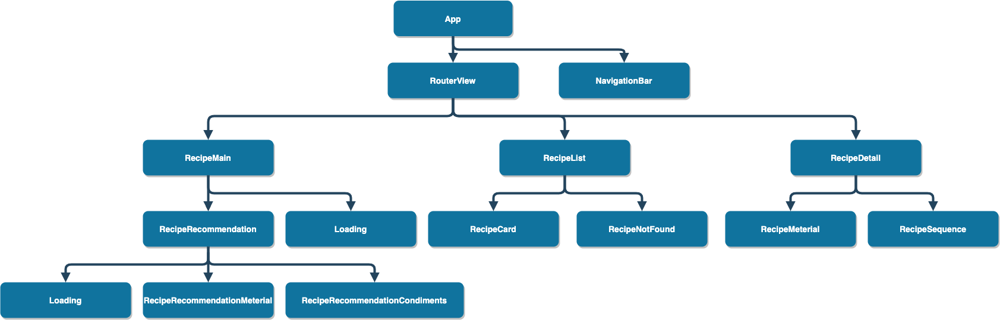
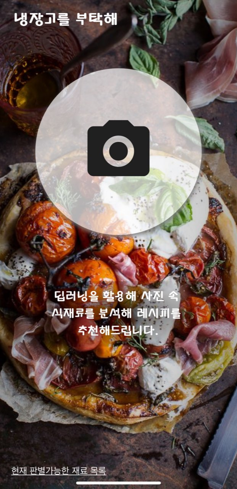
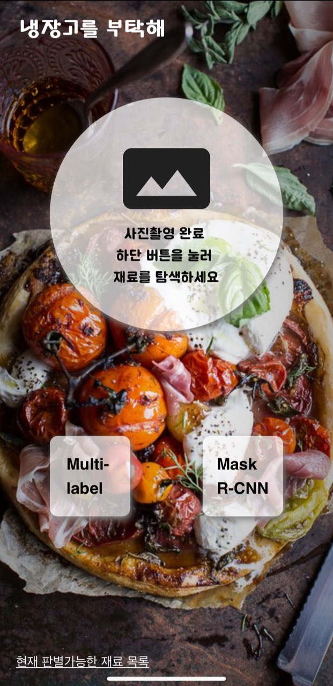
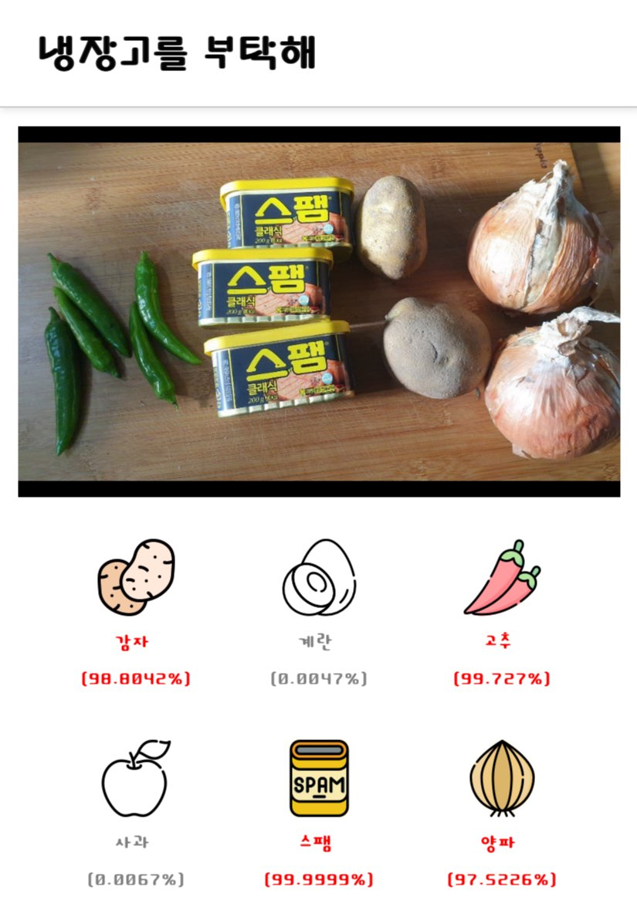
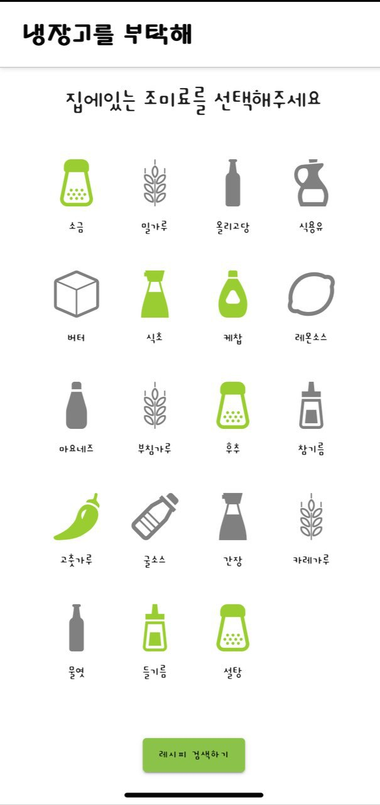
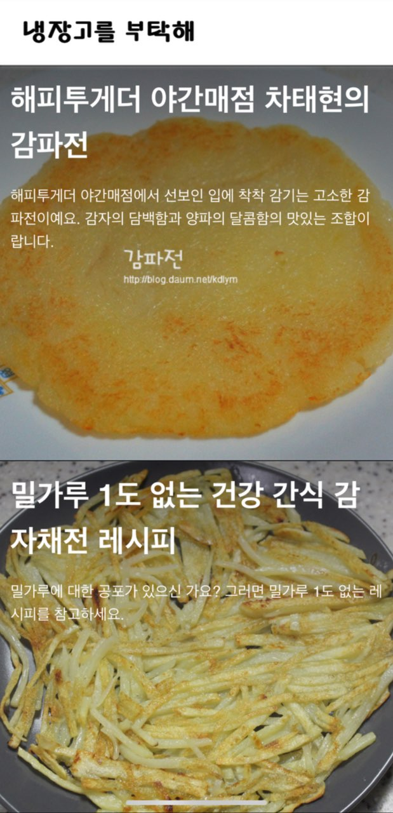
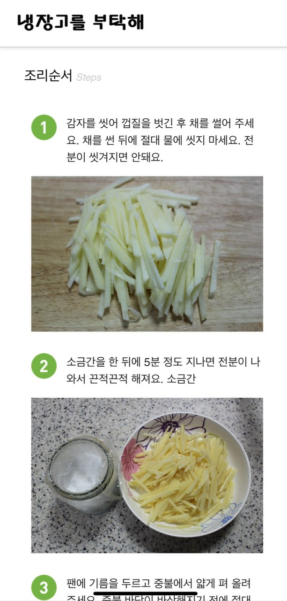

## Frontend

### 구조도



### 통신

```javascript
//http-common.js
import axios from "axios";

export default axios.create({
  baseURL: "http://i02b102.p.ssafy.io/",
  headers: {
    "Content-type": "application/json"
  }
});
```

```javascript
import http from "../services/http-common.js";
```

axios라이브러리를 사용하여 통신을 진행했으며,<br>
http-common.js파일로 모듈화하여 사용했습니다.<br>

### 1. 냉장고 사진 찍기



### 2. AI 모듈 선택하기



### 3. 판별된 재료 확인



### 4. 양념 선택



### 5. 해당하는 레시피 확인



### 6. 조리 순서 확인


